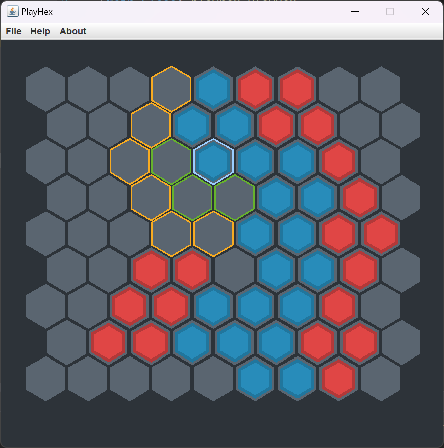

# PlayHex

---

## 简介

PlayHex，一款棋类游戏，清华大学《Java 语言程序设计》课程大作业。

## 平台

Java 17

## 授权声明

[MIT 许可证](../../LICENSE)

## 概览

## 游戏规则

红蓝两方轮流移动，红棋先行。每次移动时，玩家可选择己方的某颗棋子，向任意方向移动 1\~2 格（落子处必须为棋盘上的空格）。若玩家选择移动 1 格，则在目标网格落子后原来的棋子保留，即棋子个数增加一个；若玩家选择移动 2 格（黄色高亮区域），则在目标网格落子后原来的棋子消失，即棋子个数保持不变。

当一方移动时，若落子点相邻网格（1 格相邻）内有另一方的棋子，这些棋子全部被俘获，即更换颜色。轮到某一方移动时，若其无法移动，则剩余空格上填满另一方的棋子，并且游戏结束，棋盘上棋子多的一方获胜。

## 操作方式

+ “WASD”或方向键移动光标
+ 回车键或空格键选择
+ “Q”或“ESC”键取消选择

**感谢您的游玩！**
