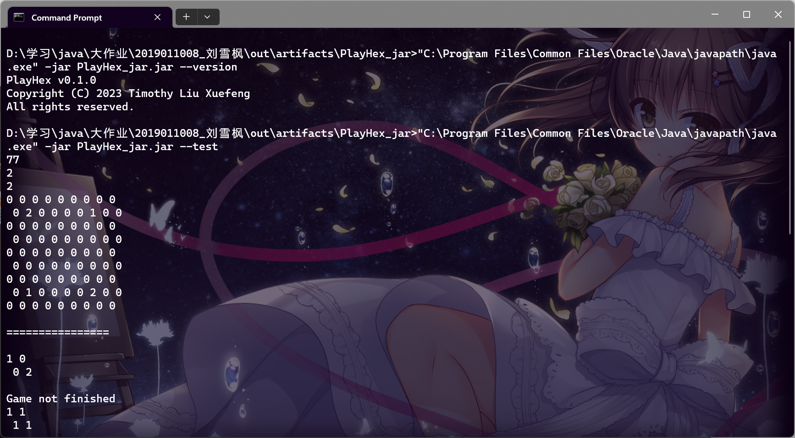
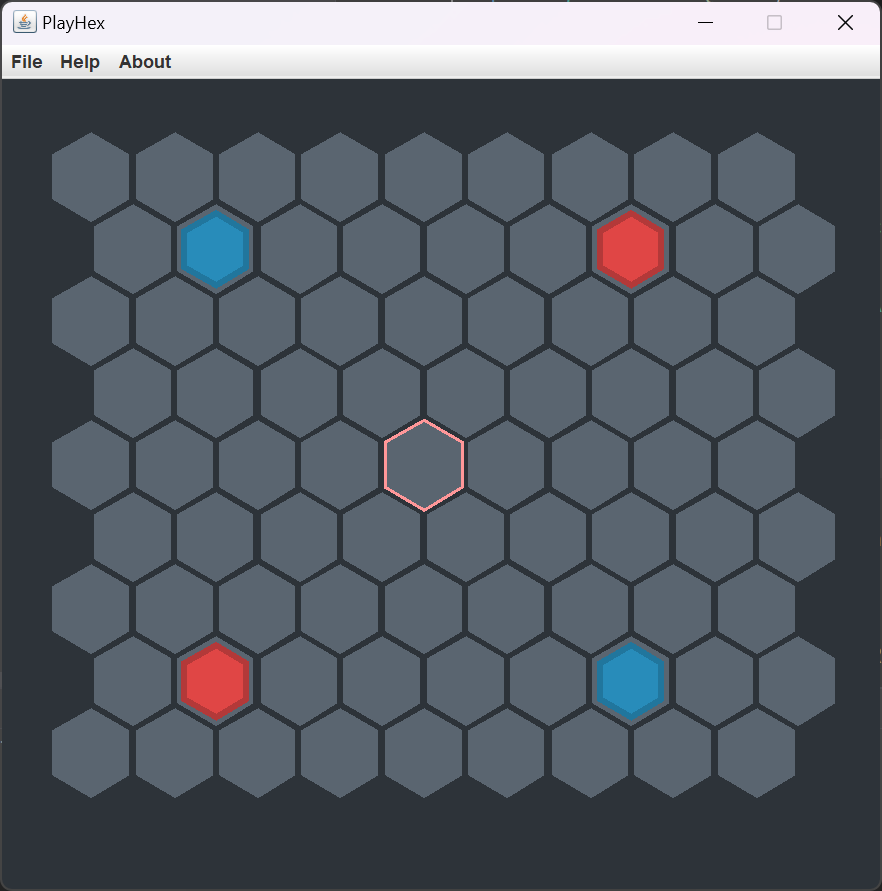
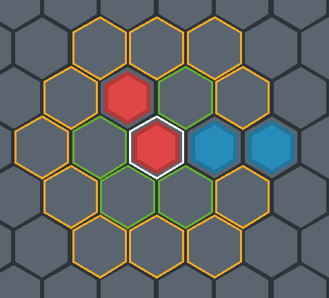
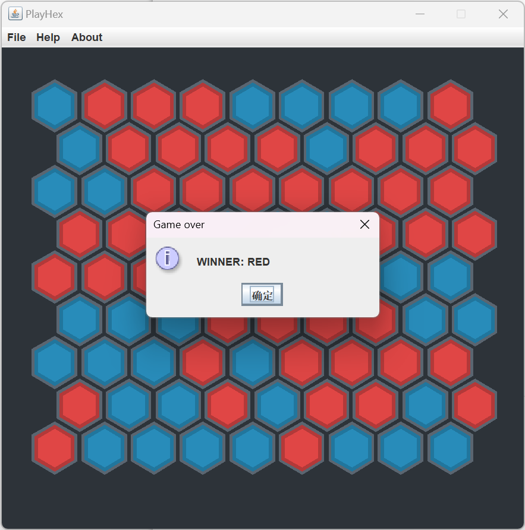
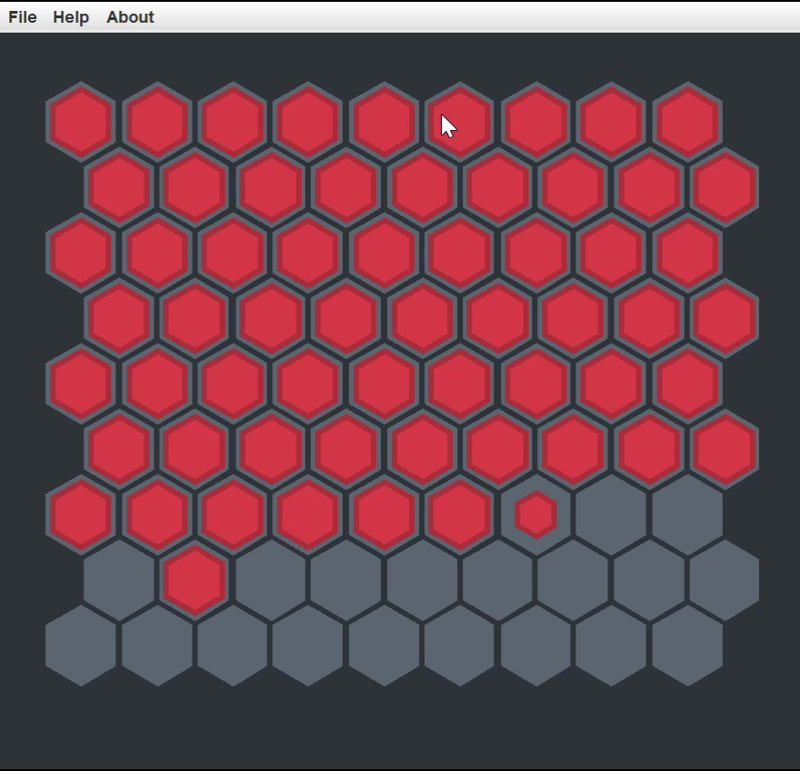
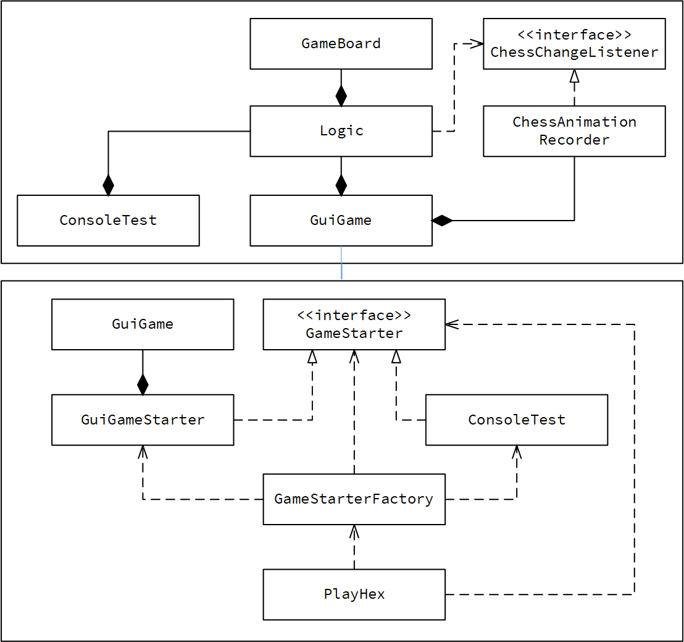

# Report

---

无 92 刘雪枫

2019011008

---

## 目录

[TOC]

## 操作方式

### 游戏操作方式

+ “WASD”或方向键移动光标，回车键或空格键选择棋子或选择落点，“Q”键或 ESC 键取消选择。

+ 光标颜色是浅红色时代表轮到红方落子，光标颜色是浅蓝色时代表轮到蓝方落子。
+ 使用“Q”键或 ESC 键取消选择时，会将光标移至原来选择的棋子处。

### 程序命令行

无命令行时启动游戏，`--version` 显示版本信息，`--test` 进入程序开发者通道控制台（需要使用 `java` 启动并加 `-jar` 参数，否则无法看到控制台输出）：

## 所需平台

实验所用 Java 版本为 Java 17。

## 实现需求

### 基本需求

#### 游戏界面

1. 棋盘：棋盘和网格形状、相对位置正确，网格间有分界线（实现为空隙）：

   

2. 着色的六边形棋子：棋子颜色分别为红色和蓝色，形状为六边形，大小略小于棋盘格子，且棋子加上了深色的边框，更为美观。

3. 棋子移动提示：

   + 移动光标：本游戏是键盘操控，因此存在移动光标。光标颜色是浅红色时代表轮到红方落子，光标颜色是浅蓝色时代表轮到蓝方落子。

   + 待移动的棋⼦，周围⼀格和周围两格有三种不同的⾼亮：待移动的棋子周围是白色，临近一格是绿色，临近两格是黄色：

     

4. 绘制游戏结果：游戏结束时，弹窗显示游戏结果：

   

#### 游戏模型

棋子的初始化、移动、移动提示、棋子俘获、交替落子、胜负判定均实现。

#### 性能需求

游戏基本做到流畅和稳定

### 扩展需求

游戏实现了作业文档中要求的全部动画效果。

1. 棋子移动时，消失的棋子由大到小逐渐消失，新出现的棋子由小到大逐渐出现

2. 棋子俘获时，也有相同的渐变过程

3. 棋子逐格填充而不是同时填充。下图为游戏结束时正在填充的棋子：

   

## 架构设计

代码将游戏逻辑、图形界面、测试、配置等完全解耦。共分为七个模块：

+ `gameboard`：用于编写棋盘、棋子等基本信息
+ `logic`：用于编写游戏逻辑：游戏的棋子移动、胜负判定等均在此编写
+ `starter`：程序入口的公共接口
+ `guigame`：程序的 GUI 入口，用于渲染游戏 GUI 界面，包括游戏窗口的绘制、菜单、消息响应等
+ `consoletest`：程序的开发者通道控制台入口，为了便于在开发时测试游戏逻辑是否编写正确
+ `playhex`：程序的 `main` 函数，用于负责解析命令行以选择相应的程序入口和行为
+ `config`：用于保存配置信息等

类设计的简化 UML 图如下（为了 UML 简洁，省去了很多不重要的类，以及用于实现具体功能的嵌套类等）：

+ `GameBoard` 类用于存储游戏棋盘的信息
+ `Logic` 类编写所有游戏逻辑，对外暴露 `moveChess` 方法用于移动棋子，以及一些用于获取游戏状态的接口
+ `GuiGame` 类渲染图形界面，并操控 `Logic` 类，根据用户输入使用 `moveChess` 移动棋子，并将游戏状态实时渲染到窗口
  + `GuiGame` 内含很多嵌套类，用于实现特定功能，例如绘图、有限状态机，等等
+ `ConsoleTest` 类用于控制台调试
+ 动画效果实现：为了实现动画效果，注意到游戏逻辑本身与放大缩小等动画效果是无关的，因此为了让前端（动画效果）与游戏逻辑解耦，游戏逻辑不该得知放大缩小等效果的实现，因此设计如下：
  + `Logic` 类中当有棋子变动时，仅通过接口 `ChessChangeListener` 对外通告棋子变化事件即可
  + `ChessAnimationRecorder` 实现 `ChessChangeListener` 接口，用于当有棋子变化事件发生时，记录该事件
  + `GuiGame` 则可以使用 `ChessAnimationRecorder` 订阅 `Logic` 发出的棋子变化事件，并在窗口处进行渲染

+ `GameStarterFactory` 采用工厂模式，处理命令行，产生相应的程序入口类，并以公共接口 `GameStarter` 返回
+ `PlayHex` 为程序最终入口，使用 `GameStarterFactory` 获得程序入口类后运行程序

